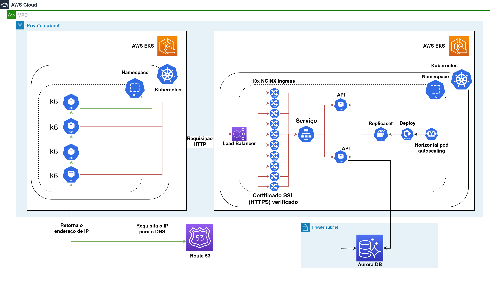
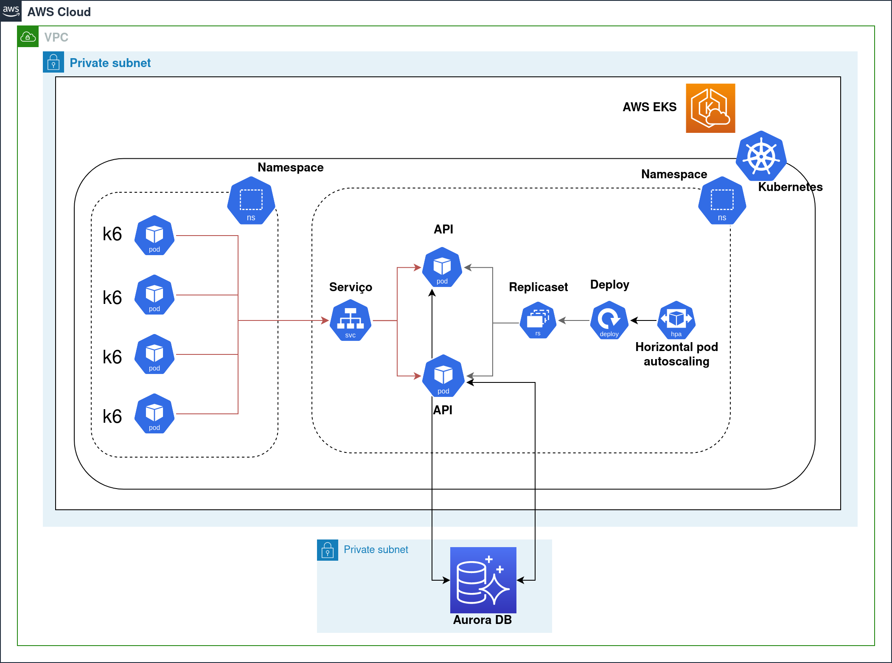

# pesquisadesempenhorequisicoesnanuvem

## Avaliação de desempenho de requisições na nuvem: existe uma melhor linguagem de programação? Quais as melhores configurações para meu negócio?

## Objetivos

1. Verificar o impacto da escolha da linguagem de programação na performance de aplicações web hospedadas em nuvem;
2. Avaliar o reflexo de mudanças nas configurações relativas aos recursos utilizados, levando em consideração um ambiente controlado contra um ambiente de nível produtivo;
3. Avaliar os custos associados as diferentes configuração utilizadas e os ganhos obtidos em cada cenário.

## AWS

A AWS é a maior plataforma de nuvem do mundo, com mais de 200 serviços e capilaridade global de seus data centers. Dessa forma, tornando-a toleravel a falhas e garantindo a replicabilidade em caso de desastres.

Por ser uma provedora de serviços em nuvem empodera seus clientes a desenvolver praticamente qualquer ideia, incluindo tecnologias emergentes como machine learning e Internet das Coisas. A AWS também é líder em segurança de nuvem, oferecendo mais de 300 recursos essenciais e serviços de segurança, conformidade e governança. A comunidade envolta da AWS e seus serviços é dinâmica, além de possuir parceiros no mundo todo incluindo milhares de integradores de sistemas e provedores independentes de software que trabalham com a AWS. Com mais de 16 anos de experiência entregando serviços de nuvem, a AWS é a plataforma de nuvem mais madura, confiável e escalável disponível, com a mais extensa infraestrutura global de nuvem.

A segurança e conformidade são responsabilidades compartilhadas entre a AWS e o cliente, o que reduz os encargos operacionais do cliente. A AWS gerencia a infraestrutura, incluindo os componentes do sistema operacional e a segurança física, enquanto o cliente gerencia o sistema operacional convidado, software de aplicativos e configuração do firewall. A responsabilidade do cliente varia com os serviços utilizados e as leis e regulamentos aplicáveis. Os clientes devem examinar cuidadosamente os serviços selecionados. Os clientes são responsáveis por gerenciar os controles específicos, como bancos de dados, aplicativos e sistemas operacionais convidados.

O modelo de responsabilidade compartilhada também se estende aos controles de TI. A AWS pode gerenciar controles associados à infraestrutura física implementada no ambiente da AWS, auxiliando a reduzir os encargos operacionais do cliente. Os clientes podem usar a documentação sobre controle e conformidade da AWS para executar seus procedimentos de avaliação e verificação de controle, conforme for necessário. A AWS gerencia controles herdados, controles compartilhados e oferece treinamento para seus funcionários.

## Aurora

O Amazon Aurora é um mecanismo de banco de dados relacional gerenciado compatível com o MySQL e o PostgreSQL, que oferece velocidade, confiabilidade e economia. O Aurora inclui um subsistema de armazenamento de alta performance e automatiza e padroniza a clusterização e a replicação de bancos de dados.

Em cenários com alta carga de trabalho, o Aurora pode oferecer até cinco vezes a taxa de processamento do MySQL e até três vezes a taxa de processamento do PostgreSQL, sem exigir alterações na maioria das aplicações existentes. Além disso, ele também faz parte do serviço de banco de dados gerenciado Amazon Relational Database Service (Amazon RDS) podendo ser escolhido a partir de uma simples ajuste no momento de configuração de novos servidores de banco de dados. As operações de gerenciamento do Aurora normalmente envolvem clusters inteiros de servidores de bancos de dados que são sincronizados por meio de replicação, em vez de instâncias de banco de dados individuais.

Uma vez que o Aurora é compatível com o MySQL e com o PostgresSQL, é possível trazer aplicações para o Aurora sem necessidade de alteração do código ou qualquer outra configuração. Assim como, caso já se possua um banco de dados populado, é possível migrar os dados de forma simples a partir de um snapshot.

## EKS

O Amazon Elastic Kubernetes Service (Amazon EKS) é um serviço gerenciado que permite executar o Kubernetes na AWS sem precisar instalar e manter seus próprios nós ou ambiente de gerenciamento. Ele executa e escala ambientes de gerenciamento do Kubernetes em várias zonas de disponibilidade, fornece atualizações e correções automáticas e está integrado a vários serviços da AWS para garantir a escalabilidade e segurança de aplicações. As aplicações executadas no Amazon EKS são totalmente compatíveis com as aplicações executadas em qualquer ambiente do Kubernetes padrão.

## K6

O K6 é uma ferramenta gratuita e de código aberto para testes de carga que auxilia desenvolvedores, engenheiros de qualidade, SDETs e SREs a testar a confiabilidade e o desempenho de seus sistemas. Ele permite realizar testes de carga de forma simples e direta, sendo otimizados para minimizar o consumo de recursos, tendo suporte para rodar testes de carga, testes baseados em navegadores e testes de caos e resilencia, além do monitoramento sintético de desempenho. O K6 é desenvolvido pela Grafana Labs e sua comunidade, possuindo um CLI com APIs amigáveis ao desenvolvedor, com metas e verificações para testes de carga orientados a resultados e fácil automação, além de suportar scripts em JavaScript ES2015/ES6.

## Go

Go é uma linguagem de programação cujo projeto inicial foi feito em setembro de 2007 por Robert Griesemer, Rob Pike e Ken Thompson. Ela foi desenvolvida pelo Google lançada como código livre em novembro de 2009. É uma linguagem compilada, focada em produtividade programação concorrente. Sua versão mais recente até o momento, a versão 1.19, foi lançada em 2 de Agosto de 2022.

## Java

Desenvolvida na década de 90 por uma equipe liderada por James Gosling na Sun Microsystems, Java é uma linguagem de programação orientada a objetos. Diferentemente de outras linguagens modernas que são compiladas para código nativo, o código Java é compilado para um bytecode que é interpretado pela Java Virtual Machine (JVM). A linguagem de programação Java é a principal linguagem utilizada na Plataforma Java (J2ME), embora não seja a única. A J2ME é frequentemente usada em dispositivos como jogos de computador, celulares, calculadoras e até mesmo em sistemas de entretenimento automotivos. Sua versão mais recente é o Java 20, lançado em 21 de março de 2023.

## Python

Criada em 1991 por Guido van Rossum, Python é uma linguagem de programação de alto nível interpretada e de tipagem dinâmica, suportando os paradigmas: orientado a objetos, imperativo, funcional e procedural. Desenvolvida de forma comunitária e gerenciada pela Python Software Foundation, ela é projetada para valorizar o esforço do programador sobre o esforço computacional, com ênfase na legibilidade do código em detrimento da velocidade ou expressividade. Com sua biblioteca padrão e módulos e frameworks desenvolvidos por terceiros, Python é amplamente utilizada para processamento de textos, dados científicos e criação de CGIs para páginas dinâmicas para a web.

## Imagens

A figura acima representa a arquitetura do reste realizado em clusters distintos, simulando um cenário real. Para que a requisição web ocorra, os pods do K6 requisitam para Route 53, o servidor de DNS da AWS o IP do load balancer do cluster alvo, depois fazem uma requisição HTTP, o load balancer encaminha as requsições para uma das 10 réplicas do NGINX Ingress que também foi responsável por validar o certificado HTTPS, por sua vez encaminha a requisição para o serviço Kubernetes, que por sua vez faz o roteamento para os pods da aplicação. Uma vez que a requisição chega aos pods da aplicação, eles consultam o banco de dados Aurora DB e a resposta segue o caminho inverso. Ainda estão representados na figura um Horizontal Pod Autoscaling (HPA), um Deployment e uma Replicaset, esses são componentes do Kubernetes responsáveis por manter o número de pods da aplicação em duas réplicas, caso o CPU dos pods da aplicação chegasse a 50% estes seriam escalados pelo HPA, cenário que nunca foi atingido.

A figura acima representa a arquitetura do reste realizado dentro do mesmo cluster, sendo um ambiente mais controlado e isolando as demais camadas de rede, load balancer e verificação do certificado HTTPS. O ambiente no qual é rodado o K6 e os pods da aplicação estão separados somente lógicamente por namespaces. Dessa forma, os pods do K6 fazem requisições web diretamente para o serviço Kubernetes que faz o roteamento para os pods da aplicação. Estes recebem a requisição e consultam o Aurora DB e respondem. A resposta segue o caminho inverso da requisição. Ainda estão representados na figura um Horizontal Pod Autoscaling (HPA), um Deployment e uma Replicaset, esses são componentes do Kubernetes responsáveis por manter o número de pods da aplicação em duas réplicas, caso o CPU dos pods da aplicação chegasse a 50% estes seriam escalados pelo HPA, cenário que nunca foi atingido.